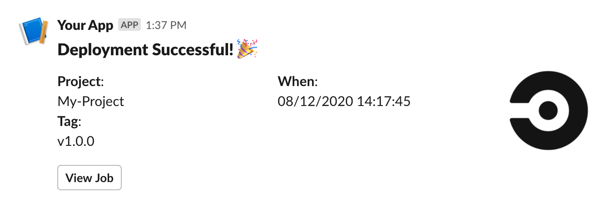

# Slack Orb  [](https://circleci.com/gh/CircleCI-Public/slack-orb) [](https://circleci.com/orbs/registry/orb/circleci/slack) [](https://raw.githubusercontent.com/circleci-public/slack-orb/master/LICENSE) [](https://discuss.circleci.com/c/ecosystem/orbs)

Send Slack notifications from your CircleCI pipelines even easier with Slack Orb 4.0

[What are Orbs?](https://circleci.com/orbs/)

## Usage

For full usage guidelines, see the [orb registry listing](http://circleci.com/orbs/registry/orb/circleci/slack).

## Templates

The Slack Orb comes with a number of included templates to get your started with minimal setup. Feel free to use an included template or create your own.

| Template Preview  | Template  | Description |
| ------------- | ------------- | ------------- |
|   | basic_fail_1   | Should be used with the "fail" event. |
|   | success_tagged_deploy_1   | To be used in the event of a successful deployment job. _see orb usage examples_ |


## Custom Message Template

  1. Open the Slack Block Kit Builder: https://app.slack.com/block-kit-builder/
  2. Design your desired notification message.
  3. Replace any placeholder values with $ENV environment variable strings.
  4. Set the resulting code as the value for your `custom` parameter.

  ```yaml
- slack/notify:
      event: always
      custom: |
        {
          "blocks": [
            {
              "type": "section",
              "fields": [
                {
                  "type": "plain_text",
                  "text": "*This is a text notification*",
                  "emoji": true
                }
              ]
            }
          ]
        }
  ```

## FAQ

**Q:**
  How can I stop duplicate messages in parallel jobs?

**A:**
  It is not possible to limit the output to a singular output. The notify command acts as a convenient and parametrizable way to send a `curl` request to the provided Slack WebHook. When a job is ran in parallel, each instance runs independently and sends its own notification.

---

**Q:**
  Is it possible to receive only the final status of the Workflow?

**A:**
  Each job within a workflow operates independently, as the orb code executes within each job, they are not able to report on the outcome of the workflow after all jobs have completed. Each job can independently report its individual status.

 ---

**Q:**
  How do I use custom environment variables?

**A:**
  Each step executes as a separate shell. To export environment variables for use in over steps, they must be added to `BASH_ENV`. View [Using Environment Variables](https://circleci.com/docs/2.0/env-vars/#using-parameters-and-bash-environment) and the included usage examples.

---

## Contributing

We welcome [issues](https://github.com/CircleCI-Public/slack-orb/issues) to and [pull requests](https://github.com/CircleCI-Public/slack-orb/pulls) against this repository!

For further questions/comments about this or other orbs, visit [CircleCI's orbs discussion forum](https://discuss.circleci.com/c/orbs).
